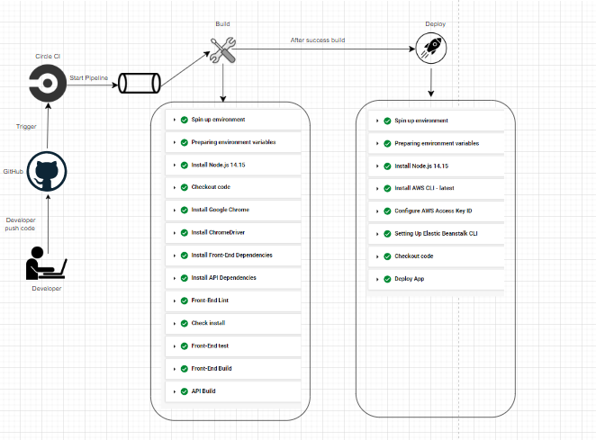

# Pipeline Description 

## Diagram:

### Steps: 

- When the developer push the code on Github

- Then it trigger circle CI 

- Then the pipeline of the app start

- The First pipe line is Build:
    - start docker image that have node version 14.15
    - Install front end dependencies
    - Install backend dependencies
    - Start lint for frontend 
    - Start Run unit test for the frontend
    - Build the frontend
    - Build the backend

- Then after success of build the Secone one if Deploy:
    - Install AWS CLI
    - Configure aws access key
    - Setup EB CLI
    - Deploy App
    - Deploy backend on Elasticbeans (EB)
    - Deploy frontend on S3 buckect

### Enviroment variables: 

### Circle ci success Build

